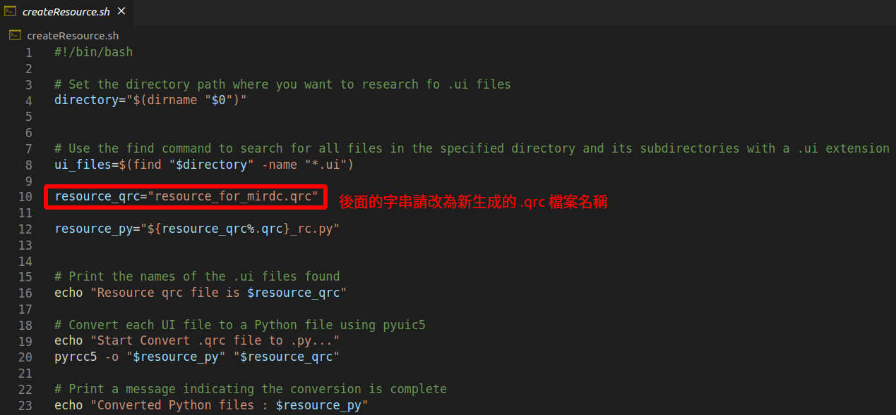

# 操作流程
---
## 說明
1. Resource 裡的 .qrc 檔是在 QT designer 裡面設置的，.qrc 檔索引入的圖片已一同置於此資料夾，但若要使用 pyqt 執行，則需要在將 .qrc 檔轉為 .py 檔

2. .qrc 檔轉成 .py 檔的腳本已經寫在此資料夾的 **createResource.sh** ，只是裡面還需要做一些變動，才能使用此腳本進行轉檔


    以下是使用腳本的注意事項
    1. 腳本內命名 **resource_qrc** 的變數要改為當前新命名的 .qrc 檔

    2. 讓腳本權限改為可執行檔
    
    ```bash=
    chmod +x createResource.sh
    ```
    3. 生成的 .py 檔會以原檔名加上 **_rc.py** 來命名，並把新生成的 .py 檔複製到外部的 View 和 Controller 資料夾(要把此檔跟開界面的程式放在同個資料夾 or 在程式內部新增此 .py 檔的路徑 ex. sys.path.append('some path'))

    ```bash=
    cp ${qrc_file_name}_rc.py ../View
    cp ${qrc_file_name}_rc.py ../Controller    
    ```